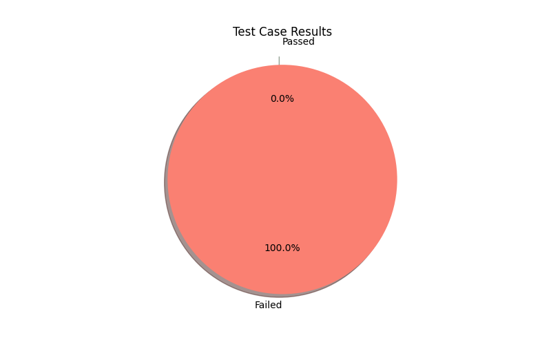

# API Testing Agent

## Overview

The **API Testing Agent** is an automated tool designed to streamline the testing of RESTful APIs. It utilizes a Swagger JSON file to extract API endpoint information and generate comprehensive test cases, including both happy and error paths. The tool employs generative AI for creating detailed prompts and provides a summary of test results, including visual representations through pie charts.

## Components

1. **SwaggerExtractor**: Loads a Swagger JSON file and extracts endpoint details.
2. **TestCasePromptBuilder**: Generates test case prompts using the extracted API data and generative AI.
3. **TestRunner**: Executes the generated test cases, validates results, and generates a detailed report.

## Setup Instructions

To set up the API Testing Agent, follow these steps:

1. **Clone the Repository**:
   ```bash
   git clone https://github.com/yourusername/api-testing-agent.git
   cd api-testing-agent
   ```

2. **Set Up API Key**:
   Update the `genai_key` in `prompt_helper.py` with your Google API key.


3. **Prepare Swagger File**:
   Place your Swagger JSON file (e.g., `petstore_swagger.json`) in the root directory of the project.

## Usage

To run the API Testing Agent, execute the following command:

```bash
python test_runner.py
```

This will:
- Load the Swagger file.
- Extract endpoint information.
- Generate test cases.
- Execute the tests and generate results.

## Results

The test results will be saved in a Markdown file (`api_testing_results.md`) and a pie chart visualizing the accuracy of the test cases will be included.

### Pie Chart Results



## Note on Accuracy

While the API Testing Agent automates the testing process and enhances efficiency, the accuracy of test case generation and validation is an area for potential improvement. Continuous refinement of the generative AI prompts and additional validation logic can help enhance reliability and accuracy in future iterations.
.

## Acknowledgements

- Thanks to the contributors and libraries that made this project possible.
