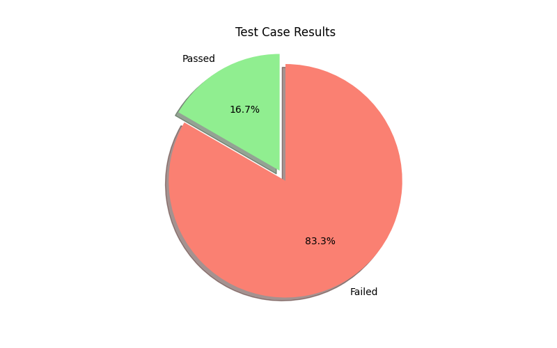

# Test Results

**Store Name:** Pet Store
**Author:** Ibrahim Nasr
**Total Passed:** 1
**Total Failed:** 5

## Summary
- **Total Test Cases Executed:** 6
- **Passed:** 1
- **Failed:** 5

### Don't worry, it's just testing!
It's not about how many times you fail, but how many times you get up! 🎉

## Detailed Results
### Test Case: **Test Case: Happy Path for GET https://petstore.swagger.io/v2/user/logout**

**Prerequisites:**
* User is logged in

**Request:**

```
GET https://petstore.swagger.io/v2/user/logout
```

**Headers:**
* Content-Type: application/json
* Authorization: Bearer <user access token>

**Expected Response:**

```json
{}
```

**Status Code:** 200 OK

**Validation:**

* The response should be an empty object.
* The user should be logged out after the request.
- **Status:** FAILED
- **Error:** No error details available

### Test Case: **Test Case: GET https://petstore.swagger.io/v2/user/logout with No Authentication**

**Test Objective:** Verify that an unauthenticated request to the user logout endpoint returns a 403 Forbidden error.

**Request:**

* **URL:** https://petstore.swagger.io/v2/user/logout
* **Method:** GET
* **Headers:**
    * None

**Expected Response:**

* **Status Code:** 403 Forbidden
* **Response Body:**
    ```
    {
        "message": "Access denied"
    }
    ```

**Test Steps:**

1. Send a GET request to the specified URL without providing any authentication credentials.
2. Verify that the response status code is 403 Forbidden.
3. Verify that the response body contains the expected message "Access denied".
- **Status:** FAILED
- **Error:** No error details available

### Test Case: **Test Case: Place an Order for a Pet**

**Request:**

**URL:** https://petstore.swagger.io/v2/store/order

**Method:** POST

**Headers:**

* Content-Type: application/json

**Body:**

```json
{
  "petId": 123,
  "quantity": 1,
  "shipDate": "2023-05-25T12:00:00Z",
  "status": "placed",
  "complete": false
}
```

**Expected Response:**

**Status Code:** 200 OK

**Headers:**

* Content-Type: application/json

**Body:**

```json
{
  "id": 123,
  "petId": 123,
  "quantity": 1,
  "shipDate": "2023-05-25T12:00:00Z",
  "status": "placed",
  "complete": false
}
```
- **Status:** FAILED
- **Error:** No error details available

### Test Case: **Test Case:**

**Request:**

**Endpoint:** https://petstore.swagger.io/v2/store/order
**Method:** POST
**Request Body:**

```
{
  "id": 10,
  "petId": 1,
  "quantity": 0,
  "shipDate": "2023-03-08T18:34:45.302Z",
  "status": "placed",
  "complete": true
}
```

**Expected Response:**

**Status Code:** 400 Bad Request
**Response Body:**

```json
{
  "code": 0,
  "message": "Invalid quantity value"
}
```

**Additional Details:**

* The request body contains an invalid value for `quantity` (0). According to the API specification, `quantity` must be greater than 0.
* The expected response includes an error code of 0 and a message indicating that the `quantity` value is invalid.
- **Status:** FAILED
- **Error:** No error details available

### Test Case: **Test Case: DELETE https://petstore.swagger.io/v2/pet/{petId} - Happy Path**

**Prerequisites:**

* A pet with the specified `petId` exists in the system.

**Request:**

**URL:** https://petstore.swagger.io/v2/pet/12345
**Method:** DELETE
**Headers:**
* Content-Type: application/json
* api_key: (Optional) Your API key

**Expected Response:**

**Status Code:** 200 OK
**Body:**
```json
{
  "code": 200,
  "type": "unknown",
  "message": "Pet deleted"
}
```

**Verification:**

* The status code should be 200 OK.
* The response body should contain a JSON object with the following properties:
    * `code`: The HTTP status code for the response (200).
    * `type`: The type of error (should be "unknown" for successful requests).
    * `message`: A message indicating that the pet was deleted.
- **Status:** FAILED
- **Error:** No error details available

### Test Case: **Test Case:**

**Request:**

* **URL:** https://petstore.swagger.io/v2/pet/99999
* **Method:** DELETE
* **Headers:**
    * api_key: (empty)
* **Body:**
    * (empty)

**Expected Response:**

* **Status Code:** 404
* **Body:**
    ```json
    {
        "code": 1,
        "type": "error",
        "message": "Pet not found"
    }
    ```
- **Status:** PASSED
- **Expected Response:**
  ```json
{
    "status_code": 400,
    "description": "Invalid input"
}
```
- **Actual Response:**
  ```json
{
    "status_code": 404,
    "output": "{\"code\":404,\"type\":\"unknown\",\"message\":\"java.lang.NumberFormatException: For input string: \\\"{petId}\\\"\"}"
}
```

## Test Case Results Pie Chart

---
Generated on: 2024-10-20 01:57:21
